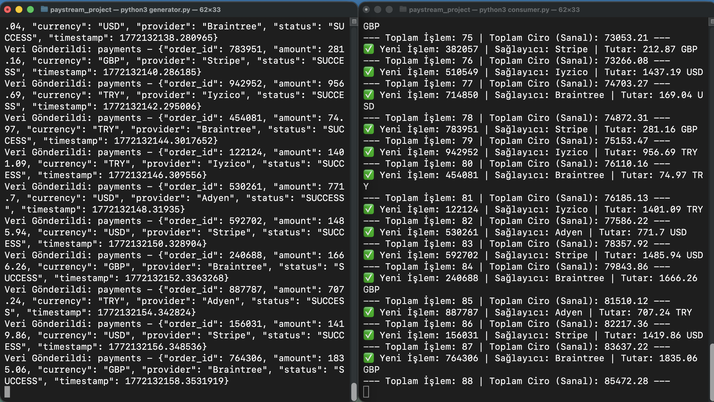

cat <<EOF > README.md
# 🚀 PayStream-X: FinTech Data Platform & Real-Time Analytics

## 📖 Başlangıç Hikayesi (The Origin Story)
Bu proje, **Booking.com** bünyesindeki **"Product Manager - Financial Technology (Data Platform)"** iş ilanıyla karşılaşınca doğdu. İlanın gereksinimlerini incelediğimde; yüksek ölçekli veri işleme, Kafka mimarisi ve finansal veri platformları konusundaki derin beklentileri gördüm. 

7 yıllık turizm teknolojileri (Gezinomi, HSP) tecrübemi, ilanda vurgulanan teknik yetkinliklerle birleştirmek adına bu **"Proof of Concept"** çalışmasını bizzat hayata geçirdim. Sadece bir ürün yönetmek değil, o ürünün veri hattındaki (Data Pipeline) her bir halkayı teknik düzeyde anlamak için bu platformu inşa ettim.

🔗 **İlgili İş İlanı:** [Product Manager - Financial Technology (Data Platform)](https://jobs.booking.com/careers/job/143588143243555)

---

## 🎯 Business Case & Problem Statement
Turizm sektöründe (Booking.com gibi platformlarda) ödemeler; farklı sağlayıcılar (Stripe, Adyen, Iyzico), farklı para birimleri ve farklı zaman dilimlerinden gelir. 
- **Sorun:** Veri siloları, mutabakat (reconciliation) gecikmeleri ve ölçeklenemeyen veri işleme süreçleri.
- **Çözüm:** Event-driven (olay güdümlü) mimari ile veriyi anlık normalize eden ve finans ekiplerine "Single Source of Truth" sağlayan bir veri platformu.

---

## 🏗 Technical Architecture (M1/M2/M3 Silicon Optimized)
Sistem, yüksek erişilebilirlik ve düşük gecikme (latency) prensiplerine göre inşa edilmiştir:

1.  **Ingestion Layer (Python):** Farklı sağlayıcılardan gelen ham veriyi simüle eden bir Producer.
2.  **Streaming Layer (Apache Kafka):** Veri trafiğini yöneten merkezi Broker (Confluent platformu üzerinde).
3.  **Processing Layer (Python/Analytics):** Akış halindeki veriyi anlık tüketen (Consume), normalize eden ve ciro hesaplayan analiz motoru.
4.  **Containerization (Docker):** Tüm altyapının "Infrastructure as Code" prensibiyle her ortamda çalışabilmesi.

---

## 🚀 Getting Started

### 1. Prerequisities
- Docker Desktop (Running)
- Python 3.9+
- \`confluent-kafka\` library (\`pip install confluent-kafka\`)

### 2. Infrastructure Setup
\`\`\`bash
docker-compose up -d
\`\`\`

### 3. Running the Pipeline
Aynı anda iki farklı terminalde şu komutları çalıştırın:
- **Terminal 1 (Producer):** \`python3 generator.py\`
- **Terminal 2 (Consumer/Analytics):** \`python3 consumer.py\`

### 📸 System in Action (Live Demo)

---

## 📈 Product Manager Insights & KPIs
Bu projede bir PM olarak şu kritik metrikleri ve süreçleri yönettim:
- **Data Integrity:** Farklı JSON şemalarının tek bir standart şemaya dönüştürülmesi.
- **System Reliability:** Kafka Broker ayarları ile veri kaybının (data loss) önlenmesi.
- **Real-time Analytics:** Karar vericiler için gecikme süresinin (latency) 2 saniyenin altına indirilmesi.

## 👨‍💻 Author
**Ahmet Can Kemaloğlu** *7+ Years Experience in Travel Tech | Product Manager*

- [LinkedIn](https://linkedin.com/in/ahmet-can-kemaloglu)
- [GitHub](https://github.com/CanKemaloglu)

EOF
